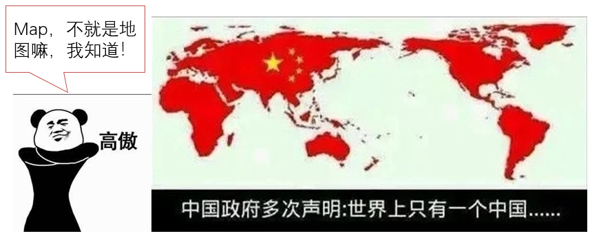
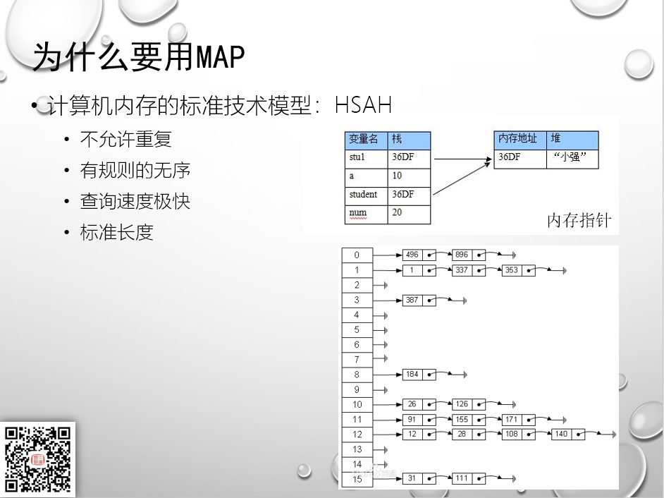
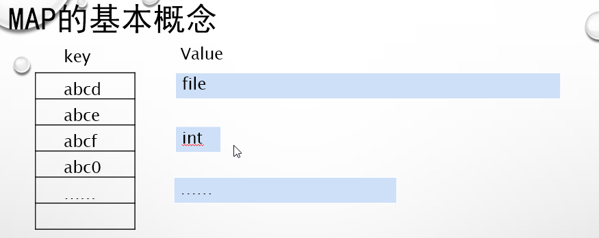
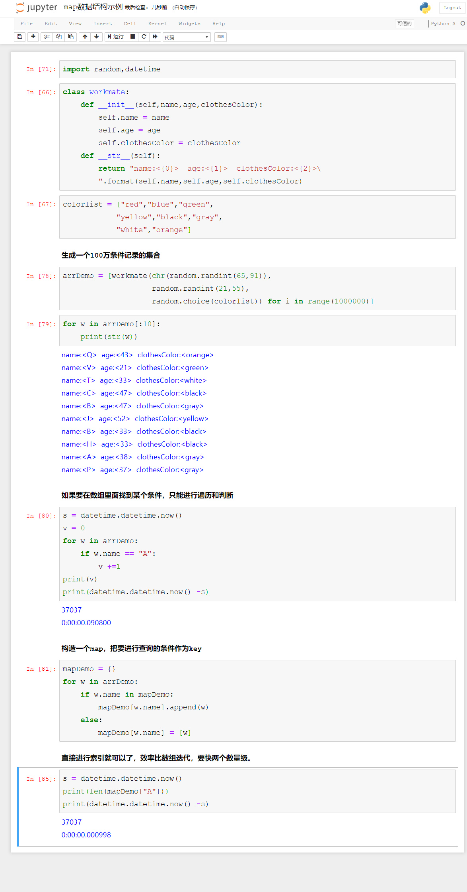
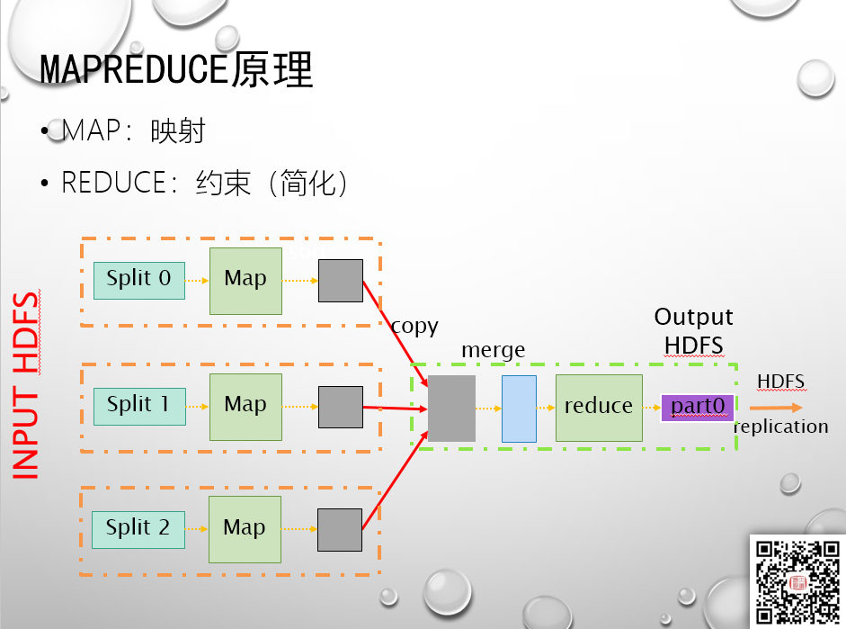
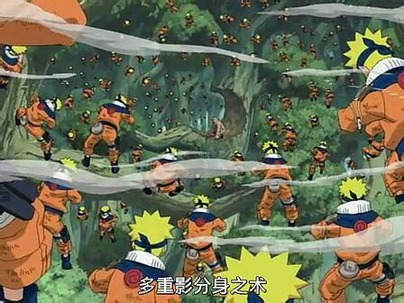
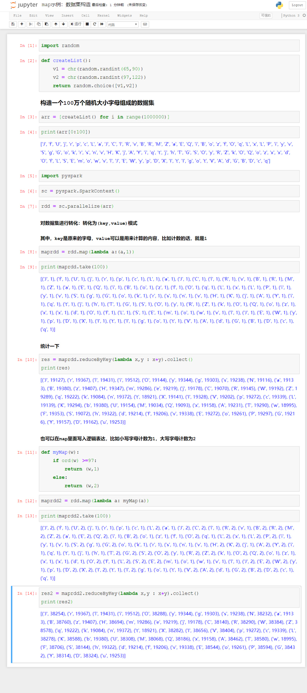

# PySpark算子处理空间数据全解析（10）：
# map算子解析（1）

上一篇说了过滤算子，实际上掌握了过滤算子，就已经掌握了空间数据处理里面最刚需的内容了，也就是说为空间关系判断的内容都可以通过这个算子来实现。

除了空间关系判断以外，还需要进行空间数据的运算，也就是需要通过计算，生成新的数据，比如相交、裁切这种操作，通过fliter算子就没辙了，所以今天开始介绍Spark里面最核心也是最常用的算子：map算子。

好吧，这里说的map，和地图没有任何关系，指的是hashmap里面那个Map，计算机数据结构里面的映射。

Spark的最早还是要追溯到hadoop和谷歌三大论里面的MapReduce处理架构，所以map算子作为hadoop时代仅有的几个标准处理算子，在Spark里面也被一脉相承的继承了下来。

关于map的详细结构，请查阅《数据结构》相关教程，这里我就不啰嗦了，最核心的在于map是由key-value模式组成：

key和value都可以是任意对象（在PySpark里面，key不能是数组和集合，这个与Scala和JAVA有点不一样，Python应用更严格）。

曾经有一个计算机学家说过这样一句话（我不记得是谁了，所以请灭老师客串一下好了）：

map的key，具备索引的强大的功能，也是四代语言的一个朴素实现，下面我们来看一个例子：

数据库的强大之处，在于强大是索引系统，那么在代码里面使用数组这种原始且效率低的结构实际上上才入行不久的程序员的本能反应，但是成熟的码农更习惯在代码中使用一些效率比较高的数据结构，比如Map，有兴趣的同学可以试试。

那么在Spark里面map算子又是啥东西呢？

先放一张标准的mapreduce架构的图片：

数据输入之后，按照任务分片，变成一个个的Map,然后在聚合起来进行运算。这个架构还是比较容易理解的，但是具体在分布运算的时候，如何来实现呢？

分布式计算的原理这里就不说了，但是我们先要知道，如果要把所有的数据分布到多台机器上去进行运算，有个核心的概念，就是数据与数据之间，不能有横向的联系，也就是经典统计学里面所谓的“样本独立性”。

所以输入数据之后，需要把数据分成一个个独立的样本个体：

单纯的分开容易但是最后要得出结果，就要把所有的数据又合并起来——这就是reduce的过程，这个过程我们以后再说。

但是在Map的情况下，各个数据都会进行计算，可能最后算出来的结果会千差万别，最后通过什么方式聚合在一起呢？为了解决这个问题，google的科学家们选用了map里面最核心的一个概念：map的key是全局唯一不可重复的，如果出现了第二个同样的key，那么就会对两个内容进行聚合——聚合的方法可以自定义，但是一个Map里面，只能保留唯一的一个Key。

下面通过一个最简单的字母统计来看看map在Spark里面是怎么用的：

Map是Spark最核心的算子，没有之一，因为它最充分的体现了RDD的操作流程：转换。把任意的数据结构转换成标准的map，然后利用key来进行聚合。对Spark的核心开发，就是对RDD的操作，而利用RDD进行数据分析，最核心的就是如何构建合理有效的map，可以说，只要选择和构建出了合理有效的Map，那么就可以用这种模式处理一起分析。

待续未完

示例中的代码，可以到虾神的github或者gitee上去下载：

Github:
https://github.com/allenlu2008/PySparkDemo

gitee：
https://gitee.com/godxia/PySparkDemo
