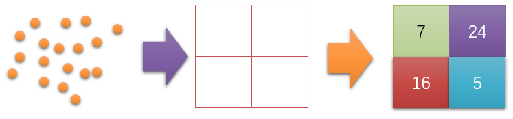
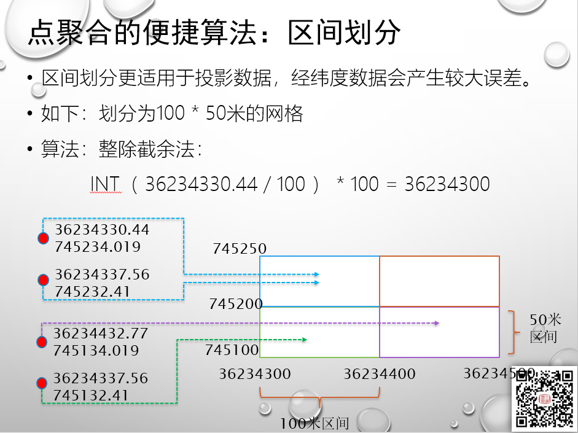
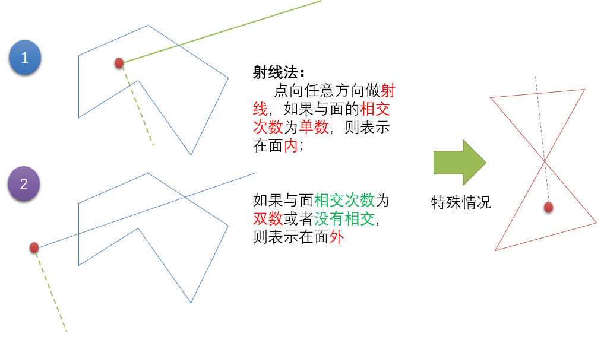
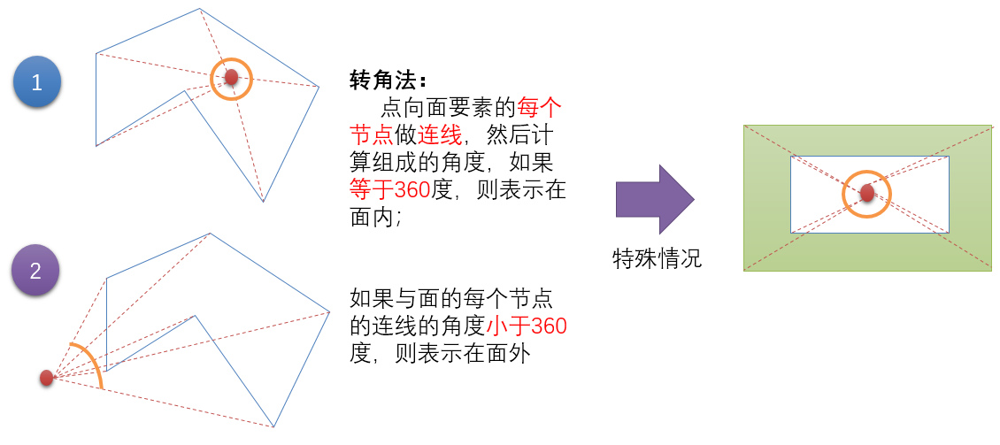
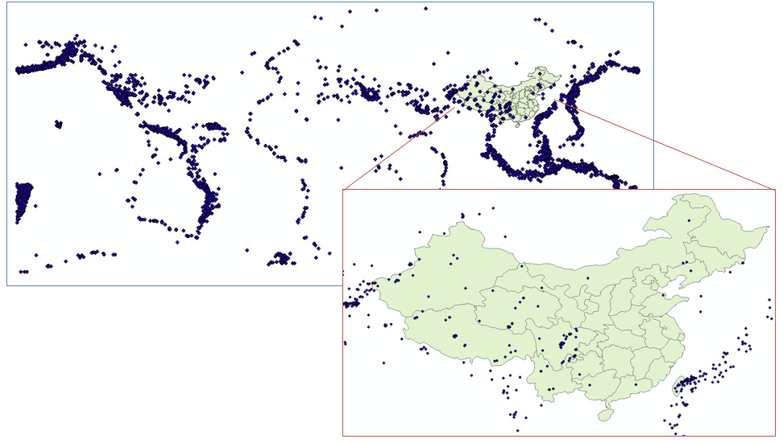
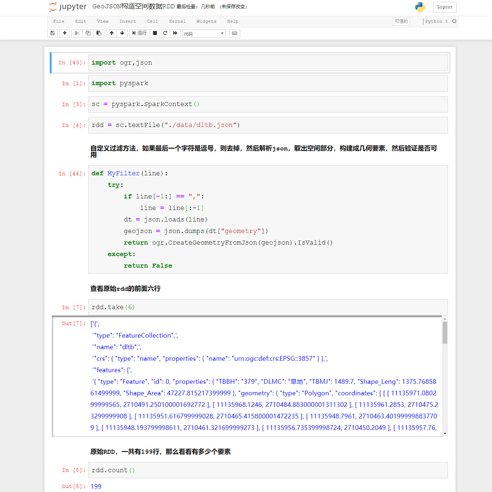
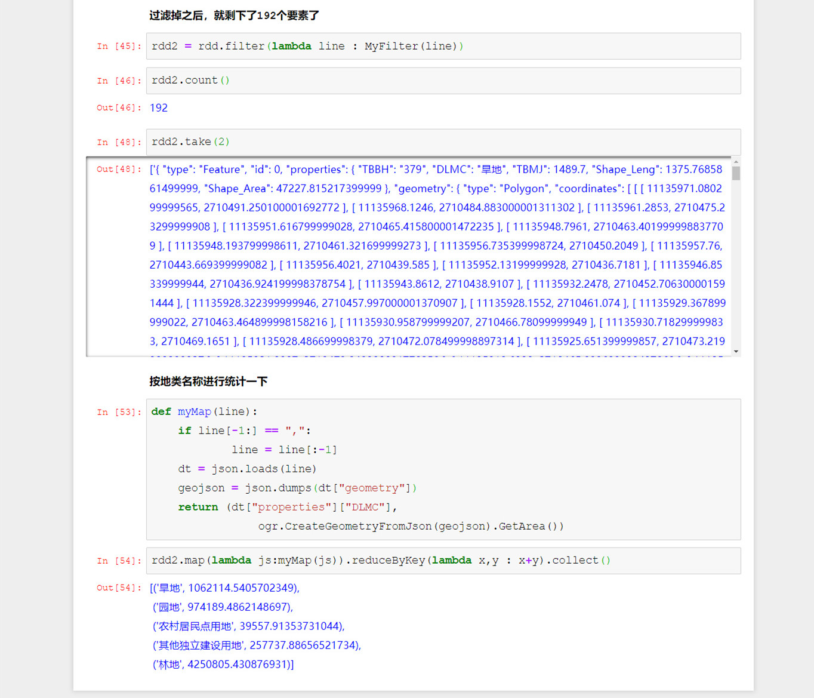
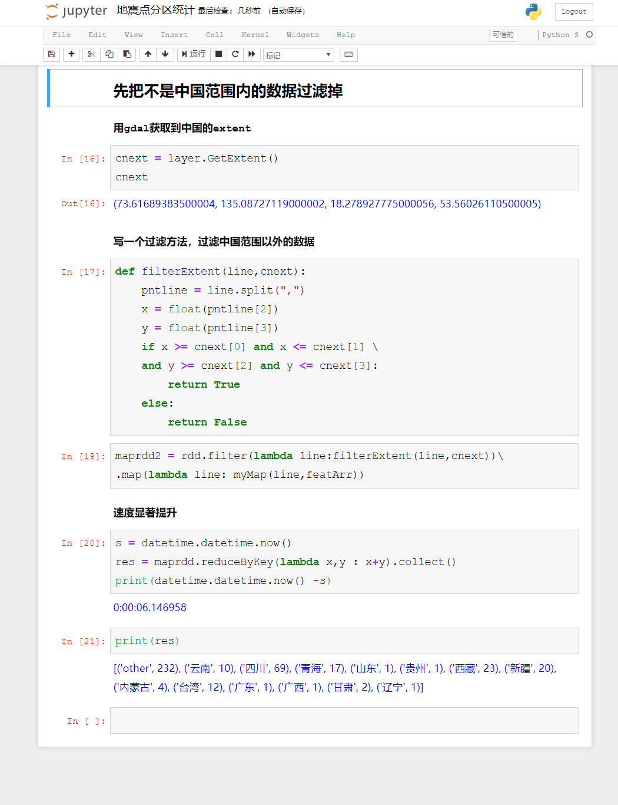

# PySpark算子处理空间数据全解析（11）：
# map算子解析（2）

上一篇说了Map算子如何构建，也说了Map算子构建的重要性：

Spark的处理数据的核心就是构建合理有效的Map结构！
Spark的处理数据的核心就是构建合理有效的Map结构！！
Spark的处理数据的核心就是构建合理有效的Map结构！！！

重要的事情说三遍。

那么今天我们来看看，空间数据分析如何构建map。

如果说过滤算子是用来获取数据，那么更进一步的最常用的空间计算，实际上就是所谓的分区统计：

有若干个点和若干个网格，现在要计算每个网格里面有多少个点在里面。

当然，有同学说，我用filter算子也可以把这个事情给做了——每个格子来做个过滤，然后算一下每个格子里面有多少个点。当然，这也是一种办法……

如果就一个格子，当然木问题，嗯，十个八个格子，也就能忍了，问题也不是太大，但是如果有10万个格子呢？然后你还有100亿个点，按照过滤的方法，把100亿个格子进行10万次循环的过滤运算？

这种计算，如果仅仅需要统计每个格子里面有多少个点的话，实际上非常非常快，特别如果是矩形的格子，仅需要一个简单的数学计算就行：

也就是说，任何一个点，只需要简单进行整除截余，就可以最快速度的知道他处于哪个格子里面了，完全不用什么复杂到七荤八素的空间包含算法。

但是如果需要进行统计的区间面，是不规则的几何要素，这种方法就不行了，就必须使用空间算法了，比如判断点包含的两种经典算法，就是射线法和转角法：

那么如果你要自己去写这算法，自然也是能实现的，但是既然有别人已经写好的东西，那又何必为难自己呢？所以实际上包含算法可以直接用GDAL或者Esri的实现就行了，但是如何做分区统计呢？特别是多个分区的统计（一个分区就懒得说了，直接filter解决问题）。

下面我们来看看最简单，最没有优化，最粗暴的迭代法进行分区统计的算法：
先来看看数据，2013年上半年的地震数据，和中国的简化的行政区划（简化了节点，主要用来示例）：

当然，为了示例，数据量都不大，理论上这点数据量，就别上Spark了，直接for个循环就接近战斗……这里主要说算法，所以就这样了……

现在我们来计算，在2013年上半年，中国的每个省分别有多少次地震被观测到。

其实计算起来，速度并不快，因为默认进行的是遍历的算法，8000多个点，32个省，就需要有8000 * 32次计算。所以我才说这是一种最简单粗暴的计算方法，那么有没有方法可以更快呢？最简单的提升的效率，就是在前面加一些筛选条件，比如在前面先加载把中国范围以外的数据先过滤掉：

遍历是最简单粗暴的方法，但是效率极低低下，这里只有32个省就慢成这样了，如果是百万对百万，那不是要老命了。而如果做过滤，那么其他的数据又不做统计了，有没有办法，快速的识别点在哪个区域里面呢？

答案当然有，那就是强大的空间索引。如何在Spark里面用上空间索引了，我们下节继续。

示例中的代码，可以到虾神的github或者gitee上去下载：

Github:
https://github.com/allenlu2008/PySparkDemo

gitee：
https://gitee.com/godxia/PySparkDemo
