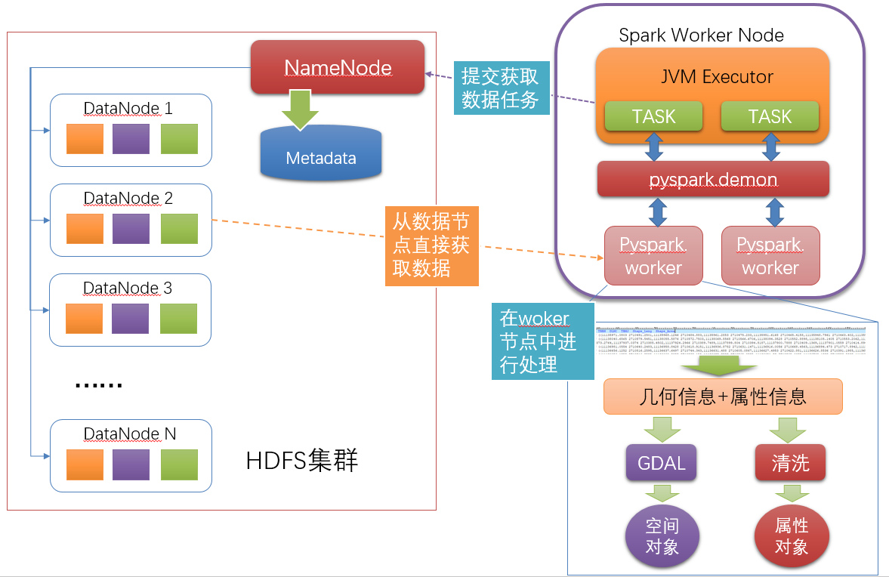
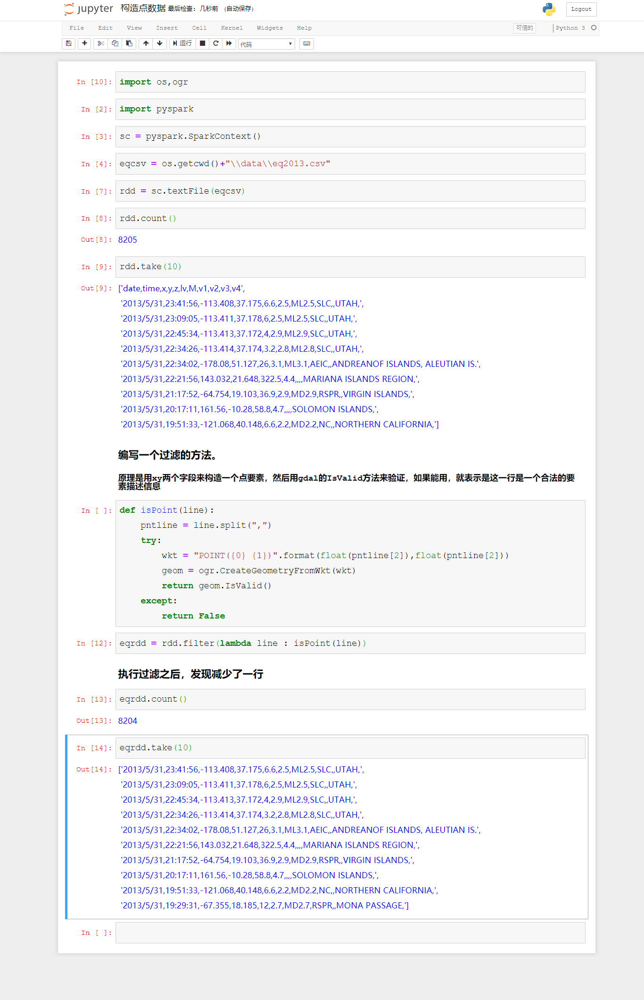
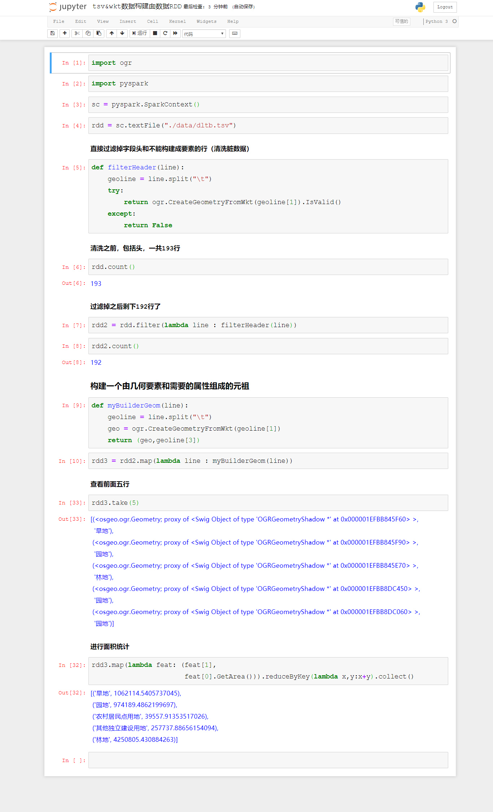
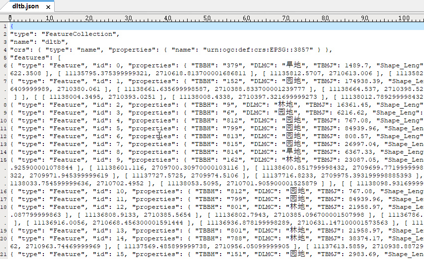
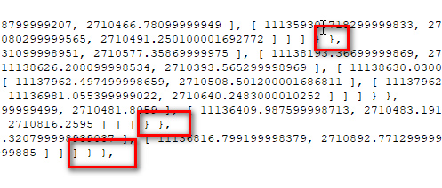
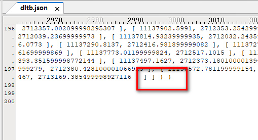
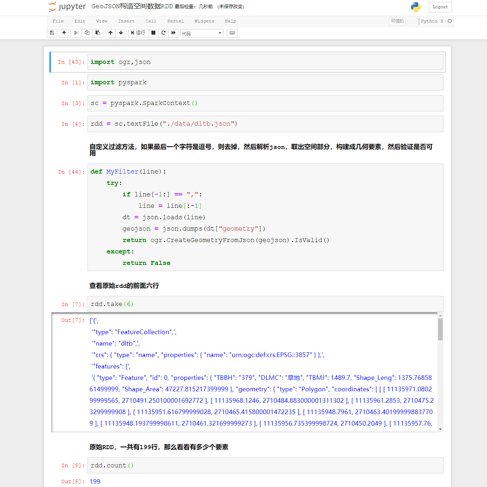
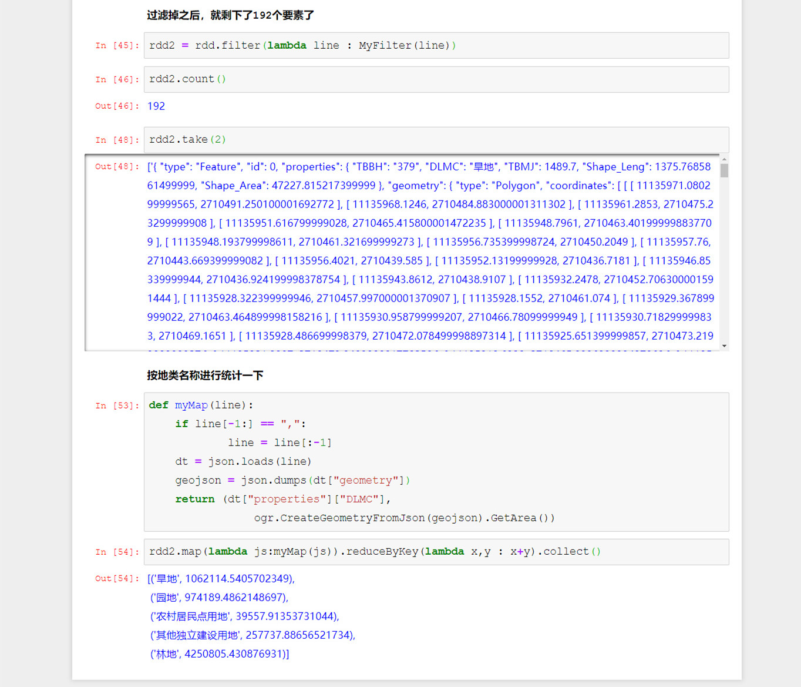
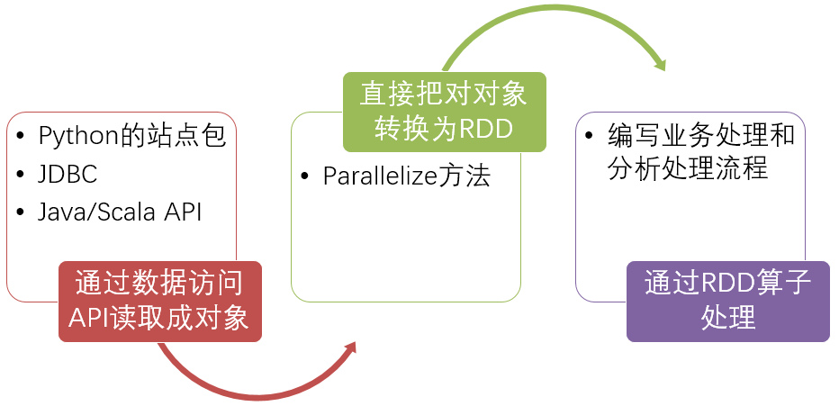
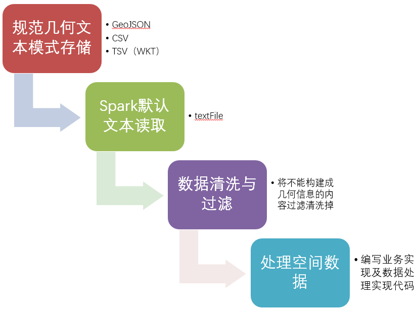

# PySpark算子处理空间数据全解析（8）：
# 构造空间数据的RDD（2）

上一篇讲了如何把空间数据变成文本数据，这一节我们来看看如何用PySpark原生的接口，来获取文本数据构造空间要素RDD。

（有问就想用Spark直接用分布式的方式读取Shapefile的同学，出门右转，ArcGIS Geoanalytics Server去了解一下，而不想用ArcGIS的去了解一下newAPIHadoopFile以及Hadoop的inputFormatClass）

如果真心想了解上面三个的，有偿私聊……免费的，请继续往下看。

如果数据已经处理成了GeoJSON或者csv\tsv格式的文本数据，那么就可以直接利用PySpark的默认接口进行分布式读取了。

读取完成之后，利用各种算子完成数据构造流程如下：

下面做一个简单的例子：

点数据的构造非常的简单，所以只需要获取到xy坐标，就可以直接构建了，那么通过filter算子，可以做一轮验证，把无法构建成点的数据都过滤掉（比如表头，比如中间有错误的）。

面数据如何构造呢？来看下面的例子：

tsv的构造模式，与csv构造点数据是一模一样的，值需要读进去每一行，后按照是否能够构建成geomatry要素进行清洗，就可以可以了，课件tsv对于空间数据是文本化模式的绝配。

如果是GeoJSON怎么办呢？我们先来看看GeoJSON文件的结构：

GeoJSON文件有这个一个问题，就是前面5行都是都是描述性的信息，那么就可以把前面5行都当成tsv/csv里面的表头来处理，把他们都过滤掉。

然后每行都是一个JSON行，这样就可以进行解析了，但是在看看最后：

每行的结尾，都有一个逗号……这样如果直接读入Json的话，百分之百会报错，那么怎么办呢？有同学说，这还不容易，直接去掉最后一个逗号就行，但是我们来看看最后一行：

最后一条记录，结尾没有逗号，所以要处理GeoJSON，需要处理以下内容：
1、开头描述信息的5行
2、过滤掉结尾的几行封闭符号
3、除去最后一行以外，每行末尾的逗号

示例代码如下:

最后总结一下，文本构造几何RDD的流程如下

第一种，序列化对象转换模式：

第二种：文本模式：

源代码：

Github:
https://github.com/allenlu2008/PySparkDemo

gitee：
https://gitee.com/godxia/PySparkDemo

