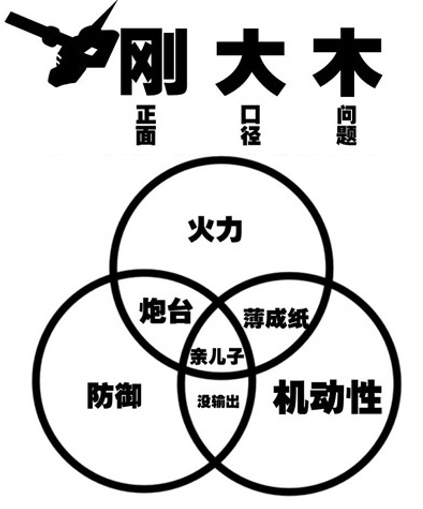
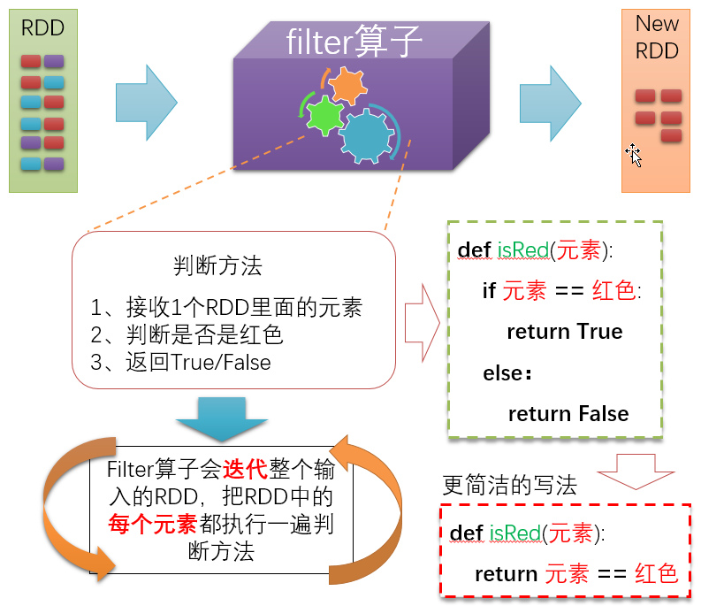
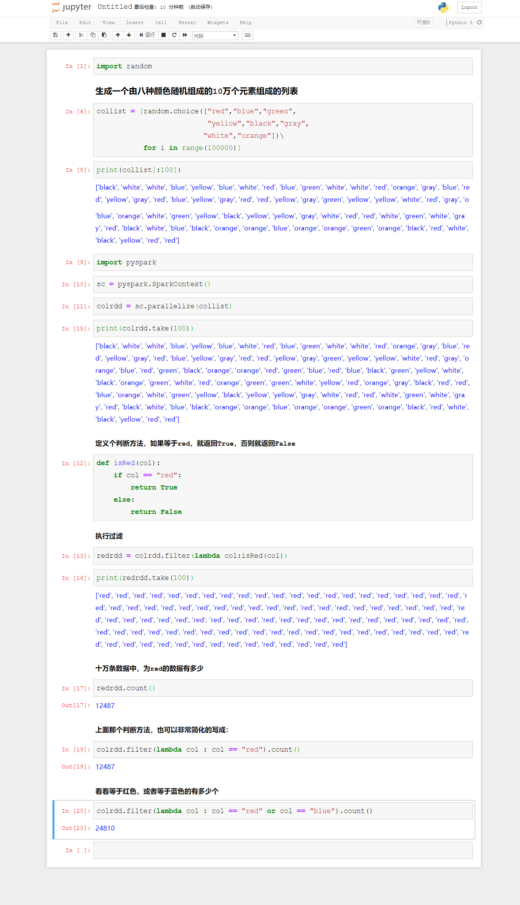
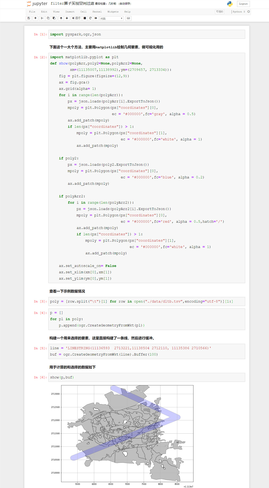
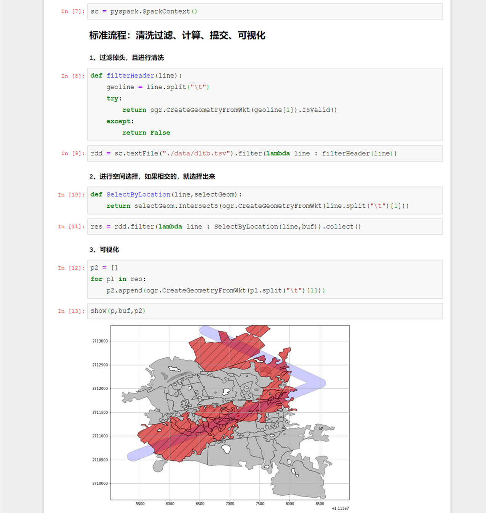
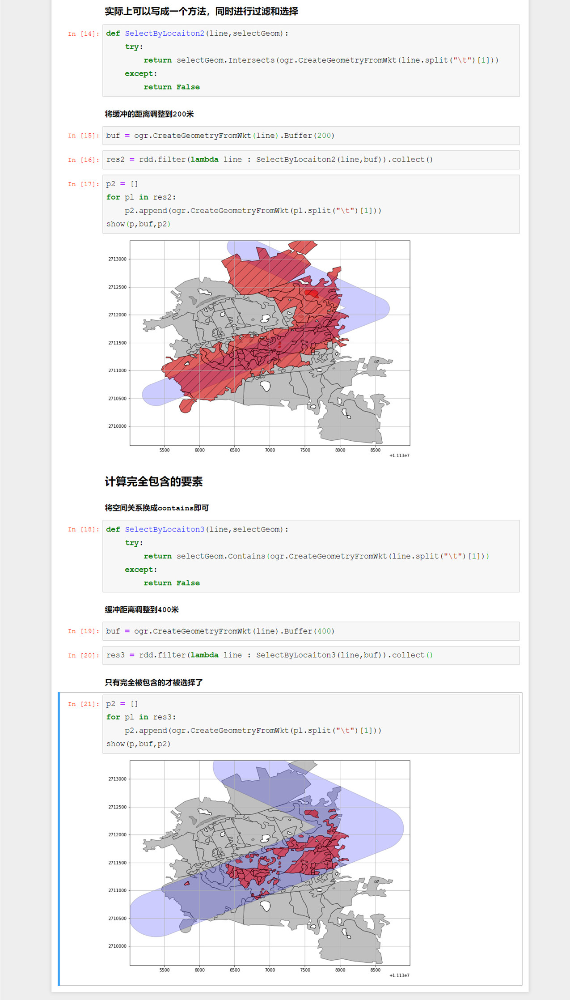

# PySpark算子处理空间数据全解析（9）：
# 空间过滤算子解析

从今天开始讲各种算子。

从海量数据中筛选出我们需要的数据，一直都是最传统的刚性需求

就像现代坦克的设计原则：

空间运算的刚大木就是利用空间关系来进行筛选。

在Spark里面，负责用于筛选的转换算子，叫做filter。

filter算子的原理如下：

Filter算子的执行方法，必须返回的是一个boolean值，然后Spark会根据这个boolean值来对你的RDD里面的元素进行过滤，运算结果为True的被过滤出来放入新的RDD，结果为False的被丢弃掉。

下面通过一个案例来看看：

filter算子是一个tranformation算子，也就是说，它本身不执行提交操作的，要查看执行的结果，或者用collect算子提交一下，或者用count算子看看数量，这个内容我们在前面说过了，这里就不赘述了。

这个算子，只要结合GDAL的空间运算API，就可以实现空间数据的过滤了，下面来看一个例子：

从什么的例子基本上就可以了解如何进行空间过滤了，空间过滤的方式主要就是Spark的算子结合GDAL的空间算法来实现，当然，如果你不想要GDAL，也可以使用ArcGIS的空间算法，或者自己写空间算法也行……但是一般是建议没必要去自己去造轮子。

示例中的代码，可以到虾神的github或者gitee上去下载：

Github:
https://github.com/allenlu2008/PySparkDemo

gitee：
https://gitee.com/godxia/PySparkDemo

待续未完。
